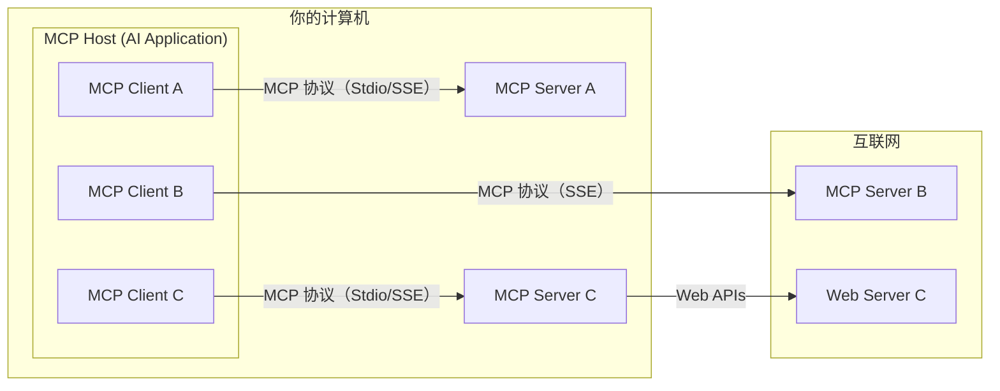
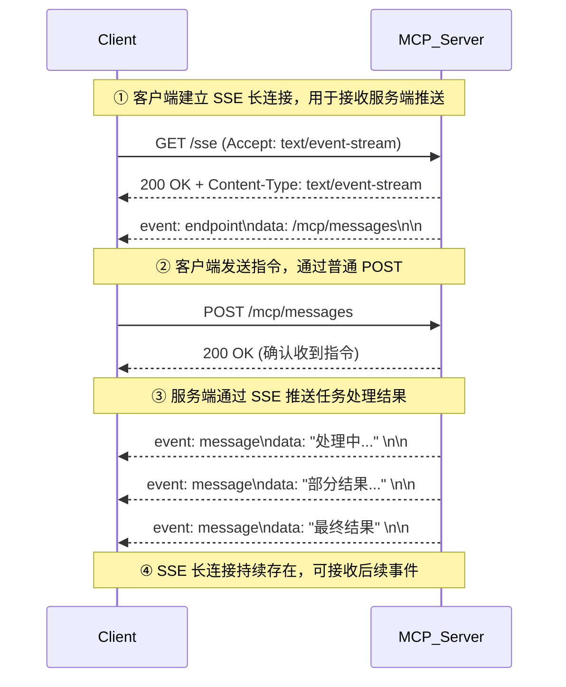

# learn-mcp

学习《MCP中文文档》（文档地址：<https://mcp-docs.cn/>）

## 一、MCP通用架构



* MCP Host: 通常为可以调用AI大模型的AI应用（如Claude Desktop），并内置有MCP客户端（MCP Client）
* MCP Client: 维护与MCP服务器（MCP Server）一对一连接的协议客户端
* MCP Server: 提供MCP服务，通过标准的MCP协议提供特定能力，传输方式包括两种（Stdio本地进程、SSE网络服务）
* Web Server: 提供Web服务，并提供一定功能的API（如高德的行政区划、天气信息查询）给MCP服务器（MCP Server）调用

## 二、MCP测试：Stdio本地进程

### 2.1 MCP服务器（mcp-server）

使用现有的AI应用（Claude Desktop）测试，需要修改配置文件（MacOS）：
`/Users/用户名/Library/Application Support/Claude/claude_desktop_config.json`

```json
{
  "mcpServers": {
    "spring-ai-mcp-weather": {
      "command": "/Library/Java/JavaVirtualMachines/jdk-17.jdk/Contents/Home/bin/java",
      "args": [
        "-Dspring.ai.mcp.server.stdio=true",
        "-jar",
        "项目绝对路径/learn-mcp/mcp-server/target/mcp-server-0.0.1-SNAPSHOT.jar"
      ],
      "env": {
        "AMAP_API_KEY": "高德API密钥"
      }
    }
  }
}
```

此MCP服务器通过调用高德API的方式查询行政区划、天气信息，所以需要前往[高德开放平台](https://lbs.amap.com/)申请高德API密钥

如果启动`Claude Desktop`报错，可以通过如下命令查看实时日志：

```bash
tail -n 20 -F ~/Library/Logs/Claude/mcp*.log
```

### 2.2 MCP客户端（mcp-client）

调用已经写好的MCP服务器，需要修改配置文件`./mcp-client/src/main/resources/mcp-servers-config.json`

此MCP客户端测试，需要用到AI大模型，由于文档中的[anthropic平台](https://www.anthropic.com/)
付费比较麻烦，所以这里使用[硅基流动平台](https://cloud.siliconflow.cn/)或[ollama平台](https://ollama.com/)（本地模型）

#### 2.2.1 ollama的使用：

* 运行模型（如果没有，会自动下载模型）

```bash
ollama run qwen3:1.7b
```

* 停止模型

```bash
ollama stop qwen3:1.7b
```

注：在`ollama`官网的`Models`菜单中会列出有哪些模型可用，其中有`tools`标签的才支持MCP调用

## 三、MCP测试：SSE网络服务

SSE（Server-Sent Events）的工作过程如下：



### 3.2 MCP服务器（mcp-server-sse）

依赖包`spring-ai-starter-mcp-server-webmvc`和`spring-ai-starter-mcp-server-webflux`均可实现基于SSE网络服务的MCP服务器，需要的核心配置如下：

```yaml
spring:
  application:
    name: mcp-server-sse
  main:
    # 使用webmvc包则设置为servlet，使用webflux包则设置为reactive
    web-application-type: servlet
  ai:
    mcp:
      server:
        enabled: true
        name: mcp-server-sse
        type: async
        sse-endpoint: /sse
        sse-message-endpoint: /mcp/messages
```

注：改用`spring-ai-starter-mcp-server-webflux`依赖包，在用`Feign`的时候会缺少`HttpMessageConverters`转换器，需要手动添加：

```java

@Bean
public HttpMessageConverters httpMessageConverters() {
    return new HttpMessageConverters(new MappingJackson2HttpMessageConverter());
}
```

测试方式：`Claude Desktop`不支持添加基于SSE的MCP服务器，可以用`Postman`的进行测试

### 3.1 MCP客户端（mcp-client-sse）

依旧沿用`mcp-client`项目的`spring-ai-starter-mcp-client`依赖包，同时在配置信息中不再配置`stdio`引用
`mcp-servers-config.json`文件，而是配置`sse`信息，内容如下：

```yaml
spring:
  application:
    name: mcp-client-sse
  main:
    web-application-type: none
  ai:
    mcp:
      client:
        enabled: true
        sse:
          connections:
            mcp-server-sse:
              url: http://127.0.0.1:8088
              sse-endpoint: /sse
```
